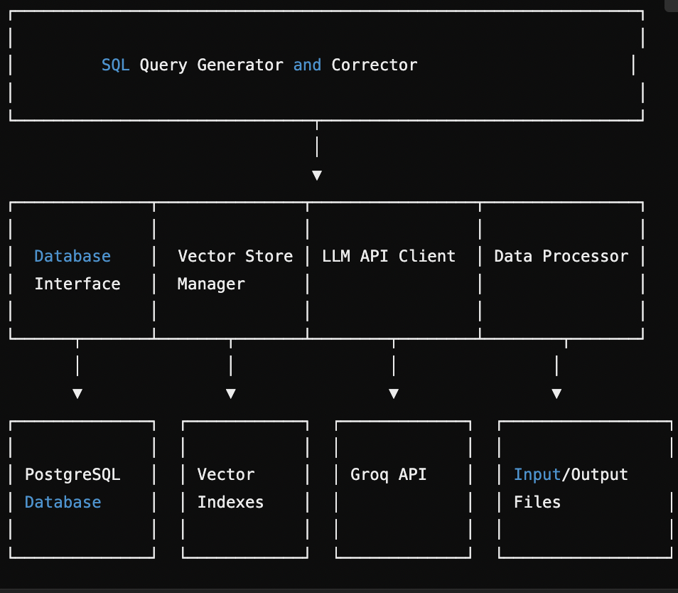

# SQL Query Generator and Corrector

A Python-based tool that converts natural language queries into SQL and corrects invalid SQL queries using the Groq API and vector similarity search.

## Overview

This application provides two main functionalities:
1. **SQL Generation**: Converts natural language queries into valid PostgreSQL queries
2. **SQL Correction**: Fixes incorrect SQL queries to make them valid and executable

The system leverages a combination of the Groq API (using LLaMA 3.1 models) and vector-based retrieval to efficiently generate and correct SQL queries while optimizing for token usage and performance.

### System Overview 


## Features

- 🔍 **Schema-aware query generation**: Utilizes database schema information to create accurate SQL queries
- 🔄 **Vector similarity search**: Reduces API calls by finding similar queries from previous examples
- ✅ **Validation and auto-correction**: Validates generated queries against the database and attempts to fix invalid ones
- 📊 **Batch processing**: Processes queries in batches to manage API rate limits
- 🔁 **Retry mechanism**: Implements exponential backoff for API call retries
- 📝 **Comprehensive logging**: Detailed logging for debugging and monitoring


## Prerequisites

- Python 3.7+
- PostgreSQL database
- Groq API key

## Installation

1. Clone the repository:
   ```
   git clone <repository-url>
   cd <repository-directory>
   ```

2. Install the required dependencies:
   ```
   pip install psycopg2 requests python-dotenv
   ```

3. Set up your environment variables:
   ```
   # Create a .env file in the project root
   echo "GROQ_API_KEY=your_groq_api_key" > .env
   ```

4. Configure the database connection in the code:
   ```python
   # Update these parameters in the code
   DB_CONFIG = {
       'dbname': 'your_database_name',
       'user': 'your_username',
       'password': 'your_password',
       'host': 'your_host',
       'port': 'your_port'
   }
   ```

## Usage

1. Prepare your input data files:
   - For SQL generation: `data/train_generate_task.json` (list of objects with "NL" field)
   - For SQL correction: `data/train_query_correction_task.json` (list of objects with "IncorrectQuery" field)

2. Run the main script:
   ```
   python main.py
   ```

3. Check the output files:
   - `output_sql_generation_task.json` - Generated SQL queries
   - `output_sql_correction_task.json` - Corrected SQL queries

## How It Works

### SQL Generation Process

1. **Schema Extraction**: First, the system extracts the database schema (tables, columns, relationships)
2. **Vector Retrieval**: For each natural language query, the system tries to find similar queries in the vector store
3. **Query Generation**: 
   - If a highly similar query is found (similarity > 0.9), it uses the stored SQL directly
   - Otherwise, it uses the Groq API with few-shot examples to generate a new SQL query
4. **Validation**: Generated queries are validated against the database
5. **Auto-correction**: If validation fails, the system attempts to fix the query

### SQL Correction Process

1. **Error Identification**: The system validates the incorrect query to identify specific errors
2. **Vector Retrieval**: Searches for similar incorrect queries with known corrections
3. **Query Correction**: 
   - If a highly similar query is found, it uses the stored correction
   - Otherwise, it uses the Groq API to generate a correction
4. **Validation**: Corrected queries are validated again to ensure they work
5. **Second-pass Correction**: If still invalid, a second correction attempt is made

## Configuration Options

- **Batch Size**: Adjust `batch_size` parameter to control how many queries are processed in each batch
- **Model Selection**: Change the `model` variable to use different Groq models
- **Similarity Threshold**: Modify the similarity score threshold (currently 0.9) for direct retrieval

## Vector Store

The system uses a vector store to index and retrieve similar queries and corrections. The vector store:

1. Builds embeddings for natural language queries and their corresponding SQL
2. Builds embeddings for incorrect SQL queries and their corrections
3. Provides fast similarity search to find relevant examples

## Error Handling

The system includes comprehensive error handling:
- Database connection errors
- API rate limiting with exponential backoff
- SQL validation errors
- File I/O errors

## Logging

Detailed logging is implemented for debugging and monitoring:
- Query processing progress
- API call information
- Error details
- Token usage statistics

## Performance Considerations

- **Token Usage**: The system tracks and optimizes token usage
- **Batch Processing**: Queries are processed in batches to manage API rate limits
- **Vector Retrieval**: Reduces API calls by using vector similarity search
- **Response Cleanup**: Cleans model responses to extract only valid SQL

1. System Architecture
1.1 Component Diagram


1.2 Data Flow


1.3 Vector Store Architecture 

